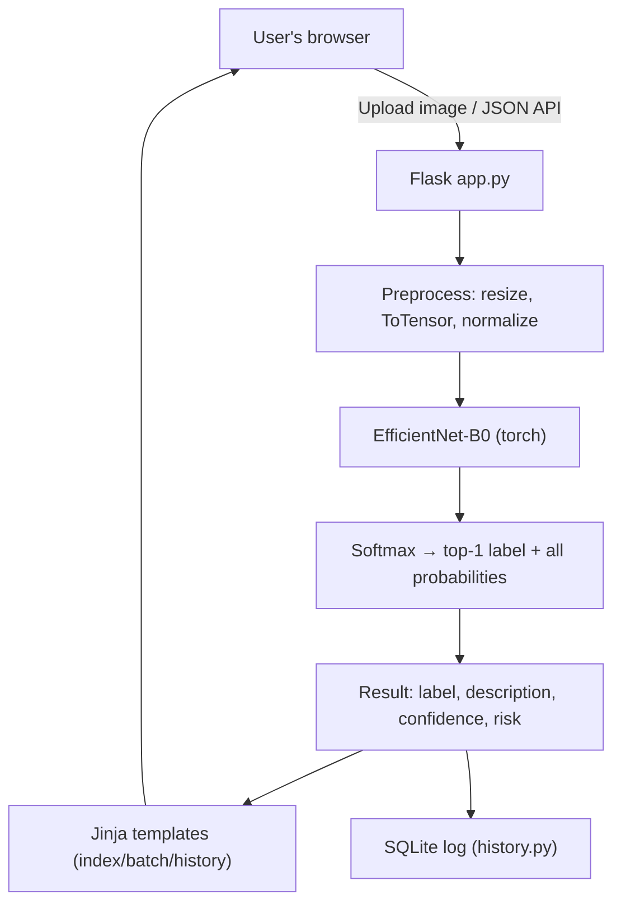

# Skin Lesion Classifier

A small Flask web application that runs a fine-tuned **EfficientNet-B0** over
dermoscopic images and returns the model's predicted lesion class, its confidence, and
a full probability breakdown across all seven classes. The app also offers batch
analysis, a JSON API, and a persistent prediction log.

> ⚠️ **Medical disclaimer.** This project is an educational / research demonstration of
> image classification with PyTorch and Flask. It is **not** a medical device and its
> outputs are **not diagnoses**. Do not use it to make clinical decisions. Always
> consult a qualified clinician for evaluation of a skin condition.

---

## Table of contents

- [Overview](#overview)
- [Features](#features)
- [Architecture](#architecture)
- [ML pipeline](#ml-pipeline)
- [Tech stack](#tech-stack)
- [Project structure](#project-structure)
- [Setup](#setup)
- [Running the app](#running-the-app)
- [Usage](#usage)
- [JSON API](#json-api)
- [Model](#model)
- [Results](#results)
- [Testing](#testing)
- [Configuration](#configuration)
- [Limitations](#limitations)
- [Future improvements](#future-improvements)
- [License](#license)

---

## Overview

The app accepts one or more skin lesion images, runs them through a PyTorch model, and
displays the predicted HAM10000-style class along with the model's confidence and a
three-bucket risk category. Every prediction is logged to a local SQLite database so
you can review or export past runs.

### Problem

Dermatologists can benefit from computer-assisted triage of dermoscopic images, but
building trustworthy medical AI needs careful evaluation, calibration, and clinical
validation. This project is a **portfolio-grade demonstration** of the ML *plumbing* —
preprocessing, inference, serving, logging, API design — around such a classifier,
without claiming any clinical utility.

---

## Features

- Single-image analysis with drag-and-drop upload, thumbnail preview, and a
  full probability breakdown across all seven classes.
- Batch analysis with a results table and browser-side CSV export.
- Prediction history: every classification (web, batch, or API) is logged to a local
  SQLite database with a per-risk-level summary and a "clear history" action.
- JSON API for programmatic access (`POST /api/predict`, `POST /api/batch`).
- `/health` endpoint that reports whether the model checkpoint is loaded.
- Graceful degradation: if the model file is missing, the app still serves the UI and
  clearly reports "Model is not loaded" instead of crashing.
- File-size cap (16 MB), extension filter, and friendly error messages for invalid
  files.
- pytest suite that exercises real inference end-to-end (no mocks).

---

## Architecture



See [`docs/ARCHITECTURE.md`](docs/ARCHITECTURE.md) for the ten engineering decisions
behind this shape — why Flask, why a single process, why SQLite, why `uv`, and so on.

---

## ML pipeline

```
Input image (JPG / PNG)
        ↓
PIL.Image.open + convert("RGB")
        ↓
Resize to 224 × 224
        ↓
ToTensor
        ↓
Normalize with ImageNet mean/std
   ([0.485, 0.456, 0.406], [0.229, 0.224, 0.225])
        ↓
EfficientNet-B0 (custom head: 1280 → 512 → 7)
        ↓
Softmax
        ↓
Top-1 label + all-class probabilities + risk category
```

---

## Tech stack

| Layer         | Choice                                              |
|---------------|-----------------------------------------------------|
| Web framework | Flask 3                                             |
| Templating    | Jinja + Bootstrap 5 + Font Awesome (CDN)            |
| ML framework  | PyTorch 2.5, Torchvision 0.20                       |
| Model         | Fine-tuned EfficientNet-B0 with a custom head       |
| Image I/O     | Pillow                                              |
| Persistence   | SQLite (standard library)                           |
| Tests         | pytest                                              |
| Env / deps    | [`uv`](https://docs.astral.sh/uv/) + `pyproject.toml` |

---

## Project structure

```
Skin-Cancer-Detection-Website/
├── app.py                  # Flask app: routes, model loading, inference
├── history.py              # SQLite prediction log
├── templates/
│   ├── index.html          # Single-image analysis
│   ├── batch.html          # Batch analysis
│   └── history.html        # Prediction history + risk summary
├── tests/
│   ├── conftest.py         # Builds a dummy checkpoint & Flask test client
│   ├── test_inference.py
│   ├── test_routes.py
│   └── test_history.py
├── docs/
│   └── ARCHITECTURE.md     # Engineering decisions & trade-offs
├── pyproject.toml          # Dependencies (managed by uv)
├── uv.lock                 # Locked, reproducible dependency graph
├── .env.example            # Template for environment variables
├── .gitignore
└── README.md
```

The `model/` directory (for the trained `.pth` checkpoint) is not committed — see
[Setup](#setup) below.

---

## Setup

The project uses [`uv`](https://docs.astral.sh/uv/) for Python environment and
dependency management. Install `uv` first if you don't already have it:

```bash
# macOS / Linux
curl -LsSf https://astral.sh/uv/install.sh | sh

# Windows (PowerShell)
powershell -c "irm https://astral.sh/uv/install.ps1 | iex"
```

Then, from the repository root:

```bash
uv sync
```

`uv sync` creates a `.venv/` in the project, pins Python to a version compatible with
`pyproject.toml`, resolves the graph from `uv.lock`, and installs everything (including
pytest, from the `dev` dependency group).

### Provide model weights

The trained checkpoint is not committed to the repo. Place your `.pth` file somewhere
convenient and point `MODEL_PATH` at it, e.g.:

```bash
# macOS / Linux
export MODEL_PATH=/path/to/skin_disease_classification_model.pth

# Windows (PowerShell)
$env:MODEL_PATH = "C:\path\to\skin_disease_classification_model.pth"
```

The default path is `./model/skin_disease_classification_model.pth`, so dropping the
file into a `model/` folder next to `app.py` also works.

If the checkpoint is missing, the app still starts and serves the UI, but classification
requests will return a "Model is not loaded" message. `/health` will report
`{"status": "ok", "model_loaded": false}`.

---

## Running the app

```bash
uv run python app.py
```

Then open <http://127.0.0.1:5000> in your browser.

For a production-style run with Gunicorn (Linux / macOS):

```bash
uv run gunicorn app:app
```

Optional environment variables (see [`.env.example`](.env.example)):

| Variable          | Default                                    | Purpose                              |
|-------------------|--------------------------------------------|--------------------------------------|
| `MODEL_PATH`      | `./model/skin_disease_classification_model.pth` | Path to the trained weights file |
| `HISTORY_DB_PATH` | `./predictions.db`                         | SQLite file for the prediction log   |
| `FLASK_DEBUG`     | `0`                                        | Enable Flask debug mode              |
| `FLASK_HOST`      | `127.0.0.1`                                | Interface for the dev server         |
| `FLASK_PORT`      | `5000`                                     | Port for the dev server              |

---

## Usage

1. Open the app in your browser.
2. Drag and drop (or click to upload) a JPG or PNG skin lesion image.
3. Click **Analyze Image**. The page shows:
   - The model's predicted class and its long-form description.
   - The model's confidence for that class.
   - A risk category (high / medium / low) derived from the predicted class.
   - The full probability breakdown across all seven classes.
4. Use the **Analyze multiple images at once** link for batch mode. The results table
   supports CSV export from the browser.
5. Use the **View history** link to see the last 50 predictions (across web, API, and
   batch) with a per-risk-level summary. You can also clear the log from that page.

---

## JSON API

All API endpoints return JSON.

### `GET /health`

Health probe. Reports whether the model checkpoint is loaded.

**Response — 200**
```json
{"status": "ok", "model_loaded": true}
```

### `POST /api/predict`

Classify a single image.

- **Request:** `multipart/form-data` with a file field named `image` (JPG or PNG).
- **Response — 200:**
  ```json
  {
    "label": "nv",
    "description": "Melanocytic Nevi",
    "confidence": 87.42,
    "risk": "low",
    "all_probabilities": [
      {"label": "nv", "description": "Melanocytic Nevi", "probability": 87.42, "risk": "low"},
      {"label": "mel", "description": "Melanoma", "probability": 6.31, "risk": "high"},
      "..."
    ]
  }
  ```
- **Errors:**
  - `400` — `{"error": "No file provided."}` / `"Unsupported file type. Use JPG or PNG."` / `"Could not read the uploaded file. Please upload a valid image."`
  - `500` — `{"error": "Inference failed."}` (logged server-side with a traceback)
  - `503` — `{"error": "Model is not loaded."}`

**Example**
```bash
curl -F "image=@lesion.jpg" http://127.0.0.1:5000/api/predict
```

### `POST /api/batch`

Classify multiple images in one request.

- **Request:** `multipart/form-data` with one or more `images` fields.
- **Response — 200:**
  ```json
  {
    "results": [
      {"filename": "a.jpg", "label": "nv", "description": "...", "confidence": 87.42, "risk": "low", "all_probabilities": [...]},
      {"filename": "b.exe", "error": "Unsupported file type"}
    ]
  }
  ```
- **Errors:** `400` for no files, `503` if the model is not loaded. Per-file failures
  are reported inside the `results` list with an `"error"` field.

---

## Model

- **Architecture.** Torchvision's `efficientnet_b0` with the classifier replaced by:
  ```
  Linear(1280 → 512) → ReLU → Dropout(0.3) → Linear(512 → 7)
  ```
- **Input.** 3 × 224 × 224 tensor, ImageNet mean/std normalized.
- **Classes.** Seven HAM10000-style dermoscopic categories:

  | Code   | Description                                    | Risk category |
  |--------|------------------------------------------------|---------------|
  | akiec  | Actinic Keratoses / Intraepithelial Carcinoma  | high          |
  | bcc    | Basal Cell Carcinoma                           | high          |
  | bkl    | Benign Keratosis-like Lesions                  | low           |
  | df     | Dermatofibroma                                 | low           |
  | mel    | Melanoma                                       | high          |
  | nv     | Melanocytic Nevi                               | low           |
  | vasc   | Vascular Lesions                               | medium        |

- **Weights.** Loaded from a `.pth` state dict at startup. Training / fine-tuning is
  out of scope for this repository — bring your own checkpoint via `MODEL_PATH`.
- **Inference device.** CPU. GPU inference works with no code changes; edit
  `device = torch.device(...)` in `app.py` if you have CUDA available.
- **Risk category.** A hard-coded mapping from class → high / medium / low. It is a UX
  hint, not an epidemiological ranking.

---

## Results

**No published evaluation metrics are shipped with this repository.** The model file is
user-provided, and its accuracy depends entirely on the checkpoint you point
`MODEL_PATH` at. Report metrics from your own evaluation run.

---

## Testing

The test suite builds a randomly-initialized EfficientNet-B0 checkpoint on the fly,
points `MODEL_PATH` at it, and exercises the real Flask routes through
`app.test_client()` — no mocks. That means the tests catch real preprocessing,
inference, and response-shape issues.

```bash
uv run pytest
```

Coverage includes:

- `run_inference` result shape, ordering, and confidence range.
- The `/`, `/batch`, `/api/predict`, `/api/batch` routes for success, missing files,
  and unsupported extensions.
- The `/history` and `/history/clear` routes and their per-risk-level summary.
- Filename validation (`allowed_file`).

---

## Configuration

Copy [`.env.example`](.env.example) to `.env` and set the values you need. Nothing in
the repository reads `.env` directly — the file is a template you can source before
starting the app (e.g. `export $(grep -v '^#' .env | xargs)` on Linux/macOS) or use with
a process manager. All variables also work as normal environment variables.

---

## Limitations

- The trained checkpoint is not distributed with the repo; results are only as good as
  the checkpoint you provide.
- Inference runs on CPU by default. A single request takes a few hundred milliseconds.
- No user auth, no rate limiting, no per-request logging beyond the prediction log.
- The seven-class list and risk mapping are baked into `app.py` and are tied to the
  HAM10000 label set.
- The app does not persist uploaded images — only the filename and prediction metadata.

---

## Future improvements

- Ship a small, honest evaluation script (`scripts/evaluate.py`) that computes accuracy
  and a confusion matrix on a held-out set and writes the numbers into this README.
- Optional Grad-CAM or saliency overlay so the user can see *what* the model looked at.
- Model-calibration reporting (reliability diagrams) so confidences reflect real
  frequencies.
- Async / worker-based inference for higher throughput.
- Docker image for a one-command demo.

---

## License

MIT. See [`pyproject.toml`](pyproject.toml).
